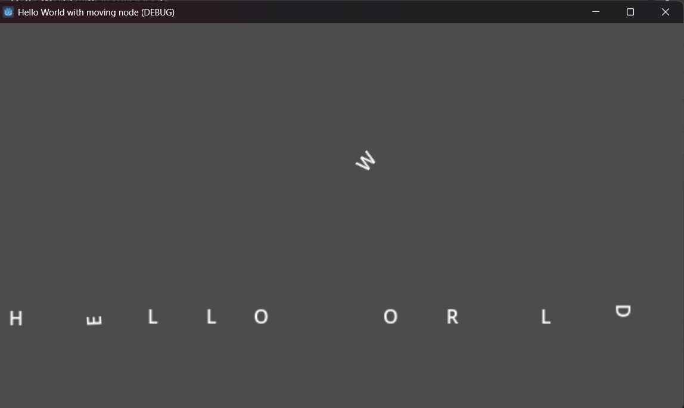

# Simple Scene with a Moving Node (Godot 4.6)

## Overview
A small project featuring a code-generated "HELLO WORLD" with drag-and-click physics and gravity. 

## Features:
- Letters generated using a GDScript.
- Physics-enabled text objects with gravity.
- Floor collider to keep the letters from falling through the screen.

## How to Play:
The repository itself contains the files of the Godot project (except screenshots). To run, you can either clone the repository or download the .ZIP file of the repository.

Clone:
1. git clone https://github.com/CharaPuffy/Simple-Scene-with-a-moving-node
2. In Godot's Project Manager, Import the cloned repository.
3. Open the game and play.

Download:
1. Click the Code button that is highlighted green then download the .ZIP file.
2. Extract the folder somewhere in your desktop.
3. Open Godot, and in Project Manager, Import the extracted folder.
4. Open the game and play.

## Gameplay Demo Screenshot

The image shows gameplay of letters being dragged and rearranged by dragging them around. Uses physics and mouse integration.

