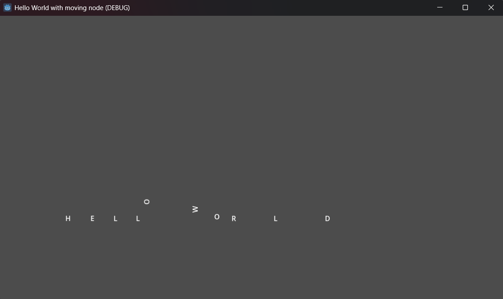

# Simple Scene with a Moving Node (Godot 4.6)

## Overview
This project demonstrates a simple Godot 4.6 scene where "HELLO WORLD" Is displayed as physical letters. Each letter is a 'RigidBody2D' that can bounce and interact with the floor.

## Features:
- Letters generated using a GDScript.
- Physics-enabled text objects.
- Floor collider to keep the letters from falling through the screen.

## Setup Instructions

1. Clone the repository:
	git clone https://github.com/CharaPuffy/Simple-Scene-with-a-moving-node

## Gameplay Demo Screenshot

This image shows gameplay of letters being dragged and rearranged by dragging them around. Uses physics and mouse integration.

